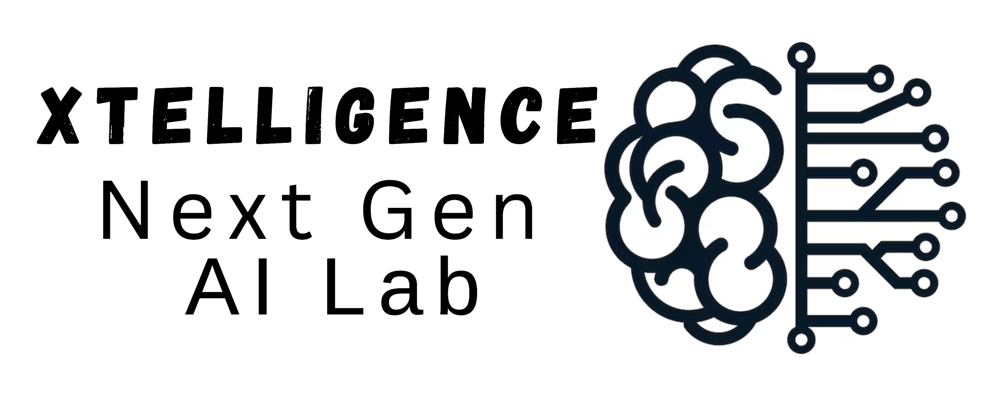

<h1>XTELLIGENCE: Next Gen AI Lab</h1>

Welcome to the <strong>XTELLIGENCE: Next Gen AI Lab</strong>! We are a research lab focused on advancing the fields of artificial intelligence, classical machine learning, deep learning, and computer vision - basically a lab with versatility and openness to exploring all aspects of AI. Our lab explores innovative methods to enable machines to perceive, understand, and interpret visual information from the world around them. Our works have applications in various domains, including healthcare and wellbeing, autonomous systems, environmental monitoring, and human-computer interaction.

Founder and Director: <a href="https://www.muzammilbehzad.com/">Dr. Muzammil Behzad</a>.

<h2>Research Areas</h2>

Our primary research interests include:

<ul>
  <li><strong>Computer Vision</strong>: Object detection, scene understanding, and image segmentation</li>
  <li><strong>Machine Learning and Deep Learning</strong>: Model development, neural networks, and representation learning</li>
  <li><strong>Vision-Language Models</strong>: Combining vision and language understanding for enhanced context</li>
  <li><strong>Affective Computing</strong>: Recognizing and interpreting emotions from facial expressions and gestures</li>
  <li><strong>Generative AI</strong>: Exploring GANs, diffusion models, and synthetic data generation</li>
  <li><strong>Human-Computer Interaction (HCI)</strong>: Enhancing user experiences with intelligent systems</li>
  <li><strong>Medical-Image Segmentation</strong>: Innovative AI based clinical solutions for healthcare</li>
</ul>

<h2>Looking Forward to Collaboration </h2>

We encourage collaboration opportunities from industrial and academic partners. I am actively looking for graduate students, postdocs and researchers to join my team.

<h2>Get in Touch</h2>

If you are interested in working with us, please reach out.

<ul>
  <li><strong>Contact Email</strong>: <a href="mailto:muzammil.behzad@gmail.com">muzammil.behzad@gmail.com</a></li>
  <li><strong>Website</strong>: <a href="https://github.com/Next-Gen-AI-Lab">XTELLIGENCE: Next Gen AI Lab</a></li>
</ul>

Thank you for visiting Anything AI Lab’s page! We look forward to advancing the field of aritificial intelligence together.

