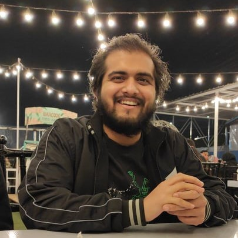

<h1>BRAIN Lab: Breakthrough Research in Next Gen AI Networks Lab</h1>

Welcome to the <strong>BRAIN Lab: Breakthrough Research in Next Gen AI Networks Lab</strong>! We are a research lab focused on advancing the fields of artificial intelligence, classical machine learning, deep learning, and computer vision - basically a lab with versatility and openness to exploring all aspects of AI. Our lab explores innovative methods to enable machines to perceive, understand, and interpret visual information from the world around them. Our works have applications in various domains, including healthcare and wellbeing, autonomous systems, environmental monitoring, and human-computer interaction.

Founder and Director: <a href="https://www.muzammilbehzad.com/">Dr. Muzammil Behzad</a>.

<h2>Members</h2>

<table>
  <tr>
    <td align="center">
       
      <b>Dr. Muzammil Behzad</b> 
      Founder and Director, BRAIN Lab 
      <a href="https://www.muzammilbehzad.com/">Homepage</a>
    </td>
  </tr>
  <tr>
    <td align="center">
       
      <b>Safa Asgar</b> 
      PhD Researcher 
      <code>Generative AI, 3D Reconstruction, Text-to-3D, Image-to-3D</code> 
      <a href="https://github.com/SaFaUU">GitHub</a> | <a href="https://www.linkedin.com/in/safa-asgar/">LinkedIn</a>
    </td>
    <td align="center">
       
      <b>Hania Ghous</b> 
      PhD Researcher 
      <code>Multiple-Organ Clsssification/Segmentation, Vision-Language Models</code> 
      <a href="github_link3">GitHub</a> | <a href="linkedin_link3">LinkedIn</a>
    </td>
    <td align="center">
       
      <b>Afraah Shahid</b> 
      MS Researcher 
      <code>Underwater Image Enhancement, Vision-Language Models</code> 
      <a href="github_link4">GitHub</a> | <a href="linkedin_link4">LinkedIn</a>
    </td>
    <td align="center">
       
      <b>Alaa Dalaq</b> 
      MS Researcher 
      <code>Object Segmentation, Vision-Language Models</code> 
      <a href="github_link4">GitHub</a> | <a href="linkedin_link4">LinkedIn</a>
    </td>
    <td align="center">
       
      <b>Thuraya</b> 
      MS Researcher 
      <code>Medical Image Analysis, Multiple-Organ Segmentation, XAI, Vision-Language Models</code> 
      <a href="github_link5">GitHub</a> | <a href="linkedin_link5">LinkedIn</a>
    </td>
  </tr>
  <tr>
    <td align="center">
       
      <b>Sana Ammar Taffor</b> 
      BS Researcher 
      <code>Medical Image Segmentation, XAI</code> 
      <a href="https://github.com/sanataff">GitHub</a> | <a href="https://www.linkedin.com/in/sana-ammar-taffour-b0491a1b2">LinkedIn</a>
    </td>
    <td align="center">
       
      <b>Almaan Khan</b> 
      BS Researcher 
      <code>Class Imbalance, Rare Object Detection</code> 
      <a href="https://github.com/A1maan">GitHub</a> | <a href="https://www.linkedin.com/in/almaan-khan-85b9b4278/">LinkedIn</a>
    </td>
    <td align="center">
       
      <b>Abdul Razaq</b> 
      BS Researcher 
      <code>Underwater Image Enhancement</code> 
      <a href="github_link8">GitHub</a> | <a href="linkedin_link8">LinkedIn</a>
    </td>
  </tr>
</table>

<h2>Research Areas</h2>

Our primary research interests include:

<ul>
  <li><strong>Anything AI</strong>: Exploring all aspects of AI</li>
  <li><strong>Computer Vision</strong>: Object detection, scene understanding, and image segmentation</li>
  <li><strong>Machine Learning and Deep Learning</strong>: Model development, neural networks, and representation learning</li>
  <li><strong>Vision-Language Models</strong>: Combining vision and language understanding for enhanced context</li>
  <li><strong>Affective Computing</strong>: Recognizing and interpreting emotions from facial expressions and gestures</li>
  <li><strong>Generative AI</strong>: Exploring GANs, diffusion models, and synthetic data generation</li>
  <li><strong>Human-Computer Interaction (HCI)</strong>: Enhancing user experiences with intelligent systems</li>
  <li><strong>AI for Healthcare</strong>: Innovative AI based clinical solutions for healthcare</li>
</ul>

<h2>Looking Forward to Collaboration </h2>

We encourage collaboration opportunities from industrial and academic partners. We are actively looking for graduate students, postdocs and researchers to join the team.

<h2>Get in Touch</h2>

If you are interested in working with us, please reach out.

<ul>
  <li><strong>Contact Email</strong>: <a href="mailto:muzammil.behzad@gmail.com">muzammil.behzad@gmail.com</a></li>
  <li><strong>Website</strong>: <a href="https://github.com/BRAIN-Lab-AI">BRAIN Lab</a></li>
</ul>

Thank you for visiting BRAIN Lab’s page! We look forward to advancing the field of aritificial intelligence together.

