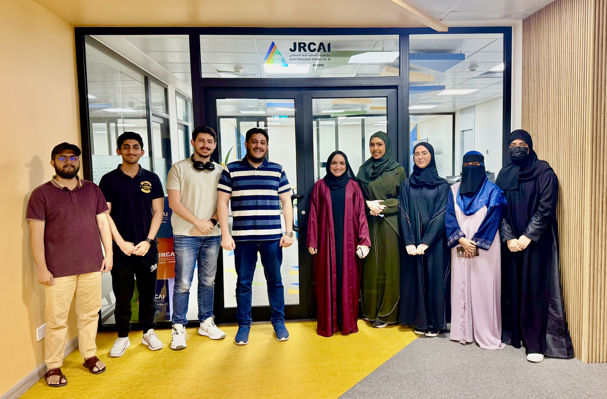
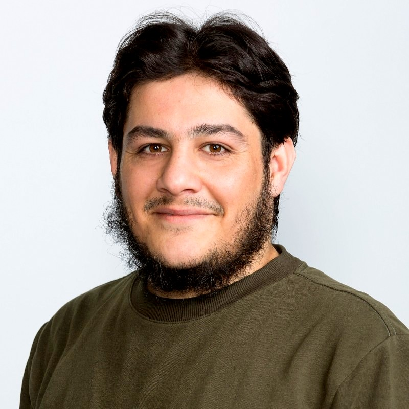
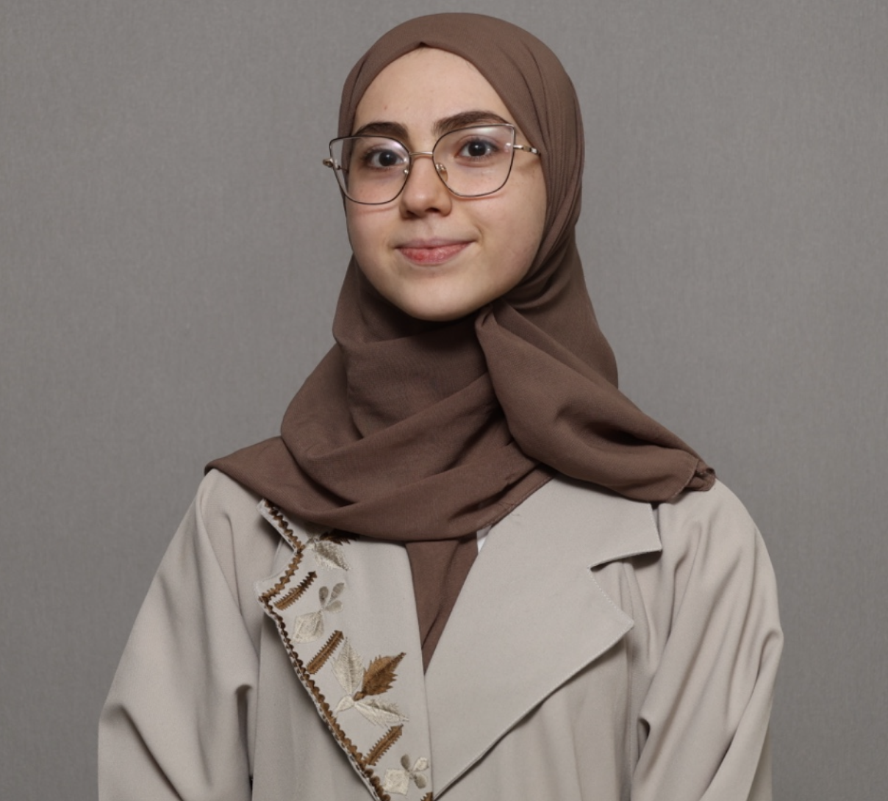
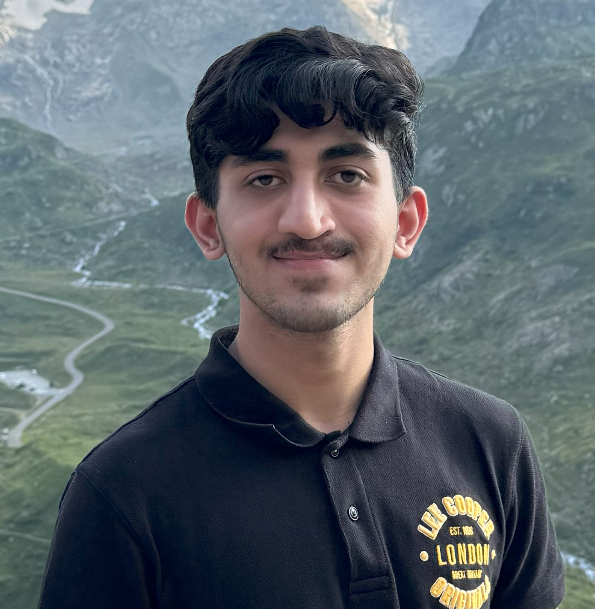

<h1>BRAIN Lab: Breakthrough Research in Next Gen AI Networks Lab</h1>

Welcome to the <strong>BRAIN Lab: Breakthrough Research in Next Gen AI Networks Lab</strong>! We are a research lab focused on advancing the fields of artificial intelligence, classical machine learning, deep learning, and computer vision - basically a lab with versatility and openness to exploring all aspects of AI. Our lab explores innovative methods to enable machines to perceive, understand, and interpret visual information from the world around them. Our works have applications in various domains, including healthcare and wellbeing, autonomous systems, environmental monitoring, and human-computer interaction.

Founder and Director: <a href="https://www.muzammilbehzad.com/">Dr. Muzammil Behzad</a>.

<h2>Members</h2>

<table>
  <tr>
    <td align="center">
       
      <b>Dr. Muzammil Behzad</b> 
      Founder and Director, BRAIN Lab 
      <a href="https://www.muzammilbehzad.com/">Homepage</a>
    </td>
  </tr>
  <tr>
    <td align="center">
       
      <b>Safa Asgar</b> 
      PhD Researcher 
      <code>Generative AI, 3D Reconstruction, Text-to-3D, Image-to-3D</code> 
      <a href="https://github.com/SaFaUU">GitHub</a> | <a href="https://www.linkedin.com/in/safa-asgar/">LinkedIn</a>
    </td>
    <td align="center">
       
      <b>Hania Ghouse</b> 
      PhD Researcher 
      <code>Multiple-Organ Clsssification/Segmentation, Vision-Language Models</code> 
      <a href="https://github.com/HaniaGhouse0407">GitHub</a> | <a href="https://in.linkedin.com/in/hania-ghouse-a86632201">LinkedIn</a>
    </td>
    <td align="center">
       
      <b>Afraah Shahid</b> 
      MS Researcher 
      <code>Underwater Image Enhancement, Vision-Language Models</code> 
      <a href="https://github.com/AfrahMS">GitHub</a> | <a href="linkedin_link4">LinkedIn</a>
    </td>
    <td align="center">
       
      <b>Alaa Dalaq</b> 
      MS Researcher 
      <code>Object Segmentation, Vision-Language Models</code> 
      <a href="github_link4">GitHub</a> | <a href="https://www.linkedin.com/in/afrah-shaahid-76967421a">LinkedIn</a>
    </td>
    <td align="center">
       
      <b>Thuraya Alzubaidi</b> 
      MS Researcher 
      <code>Medical Image Analysis, Multiple-Organ Segmentation, XAI, Vision-Language Models</code> 
      <a href="github_link5">GitHub</a> | <a href="linkedin_link5">LinkedIn</a>
    </td>
  </tr>
  <tr>
    <td align="center">
       
      <b>Sana Ammar Taffor</b> 
      BS Researcher 
      <code>Medical Image Segmentation, XAI</code> 
      <a href="https://github.com/sanataff">GitHub</a> | <a href="https://www.linkedin.com/in/sana-ammar-taffour-b0491a1b2">LinkedIn</a>
    </td>
    <td align="center">
       
      <b>Almaan Khan</b> 
      BS Researcher 
      <code>Class Imbalance, Rare Object Detection</code> 
      <a href="https://github.com/A1maan">GitHub</a> | <a href="https://www.linkedin.com/in/almaan-khan-85b9b4278/">LinkedIn</a>
    </td>
    <td align="center">
       
      <b>Abdul Razaq</b> 
      BS Researcher 
      <code>Underwater Image Enhancement</code> 
      <a href="github_link8">GitHub</a> | <a href="linkedin_link8">LinkedIn</a>
    </td>
  </tr>
</table>

<h2>Research Areas</h2>

Our primary research interests include:

<ul>
  <li><strong>Anything AI</strong>: Exploring all aspects of AI</li>
  <li><strong>Computer Vision</strong>: Object detection, scene understanding, and image segmentation</li>
  <li><strong>Machine Learning and Deep Learning</strong>: Model development, neural networks, and representation learning</li>
  <li><strong>Vision-Language Models</strong>: Combining vision and language understanding for enhanced context</li>
  <li><strong>Affective Computing</strong>: Recognizing and interpreting emotions from facial expressions and gestures</li>
  <li><strong>Generative AI</strong>: Exploring GANs, diffusion models, and synthetic data generation</li>
  <li><strong>Human-Computer Interaction (HCI)</strong>: Enhancing user experiences with intelligent systems</li>
  <li><strong>AI for Healthcare</strong>: Innovative AI based clinical solutions for healthcare</li>
</ul>

<h2>News</h2>

<ul>
  <li><b>2025.05</b>: 📣 Our team (Thuraya and Sana) has won the 2nd place in the poster competition in Women in Data Science (WiDs 2025) conference.</li>
  <li><b>2025.04</b>: 📣 Safa started working as a PhD researcher on generative AI for medical 3D data.</li>
  <li><b>2025.04</b>: 📣 Hania got admitted to PhD program at KFUPM, Saudi Arabia.</li>
  <li><b>2025.04</b>: 📣 Thuraya got admitted to MS program at KFUPM, Saudi Arabia.</li>
  <li><b>2025.04</b>: 📣 Sana and Thuraya's poster accepted in Women in Data Science (WiDS) 2025 poster competition in KFUPM, Saudi Arabia.</li>
  <li><b>2025.04</b>: 📣 Dr. Muzammil's paper accepted in 19th IEEE Int. Conf. on Automatic Face and Gesture Recognition 2025, Florida, US. </li>
  <li><b>2025.04</b>: 📣 Sana's poster accepted in 16th Student Research Conference on Applied Computing 2025, Abu Dhabi, UAE.</li>
  <li><b>2025.04</b>: 📣 Abdulmobeen's poster accepted in 16th Student Research Conference on Applied Computing 2025, Abu Dhabi, UAE.</li>  
  <li><b>2025.02</b>: 📣 Dr. Muzammil funded project on AI models for multimodal based differentiation of ocular neoplasia as PI is approved.</li> 
  <li><b>2025.02</b>: 📣 Dr. Muzammil participated in LEAP Conference in Riyadh, Saudi Arabia.</li>
  <li><b>2025.02</b>: 📣 Hania started working as a visiting researcher on multiple organ segmentation and medical analysis.</li>
  <li><b>2025.02</b>: 📣 Dr. Muzammil's funded project on vision language model for emotion recognition as PI approved.</li>  
  <li><b>2025.01</b>: 📣 Abdulmobeen started working as an undergrad researcher on tackling data imbalance in rare object detection.</li>
  <li><b>2025.01</b>: 📣 Thuraya started working as a visiting researcher on explainability of vision language models</li>
  <li><b>2025.01</b>: 📣 Abdulrazaq started working as an undergrad researcher on transformer models for underwater image enhancement.</li>
  <li><b>2025.01</b>: 📣 Sana started working as an undergrad researcher on explainability for medical image segmentation.</li>
  <li><b>2024.11</b>: 📣 Dr. Muzammil gave a seminar on emotion recogniton from 3D/4D faces in KFUPM, Saudi Arabia.</li>
  <li><b>2024.11</b>: 📣 Afraah's poster accepted in AITS poster competition in KFUPM, Saudi Arabia.</li>
  <li><b>2024.10</b>: 📣 Afraah's poster accepted in JRCAI poster competition in KFUPM, Saudi Arabia.</li>
  <li><b>2024.09</b>: 📣 Dr. Muzammil participated in Int. Conf. on Smart Mobility and Logistics Ecosystem (SMILE) in KFUPM, Saudi Arabia.</li>
  <li><b>2024.10</b>: 📣 Alaa started working as an MS researcher on vision language models for semantic segmentation.</li>
  <li><b>2024.09</b>: 📣 Dr. Muzammil participated in Global AI GAIN Summit in Riyadh, Saudi Arabia.</li>
  <li><b>2024.09</b>: 📣 Afraah started working as an MS researcher on underwater visual enhancements.</li>  
  <li><b>2024.09</b>: 📣 Dr. Muzammil affiliated as a research fellow with SDAIA-KFUPM Joint Research Centre on AI (JRC-AI), Saudi Arabia.</li>
  <li><b>2024.09</b>: 📣 Dr. Muzammil officially appointed as Mentor for the students of KFUPM, Saudi Arabia.</li>
</ul>

<h2>Looking Forward to Collaboration </h2>

We encourage collaboration opportunities from industrial and academic partners. We are actively looking for graduate students, postdocs and researchers to join the team.

<h2>Get in Touch</h2>

If you are interested in working with us, please reach out.

<ul>
  <li><strong>Contact Email</strong>: <a href="mailto:muzammil.behzad@gmail.com">muzammil.behzad@gmail.com</a></li>
  <li><strong>Website</strong>: <a href="https://github.com/BRAIN-Lab-AI">BRAIN Lab</a></li>
</ul>

Thank you for visiting BRAIN Lab’s page! We look forward to advancing the field of aritificial intelligence together.

